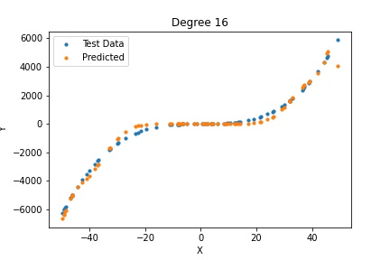

# Task1
Linear Regression is a machine learning algorithm based on supervised learning. It performs a regression task. Regression models a target prediction value based on independent variables. It is mostly used for finding out the relationship between variables and forecasting. This function takes 2 variables let say first variable X and second variable Y where Y is column matrix(vector) of order n and X is a (m+1)*n matrix which gives m cofficents(a1 to am) and 1 intercept (a0) in a hypothesis function

&nbsp;&nbsp;&nbsp;&nbsp;&nbsp;&nbsp;&nbsp;&nbsp;&nbsp;&nbsp;&nbsp;&nbsp;&nbsp;&nbsp;&nbsp;&nbsp;&nbsp;&nbsp; <b>h = a0 + a1*b1 + a2*b2+ ... + am-1*bm-1+ am*bm</b> 
&nbsp;&nbsp;&nbsp;&nbsp;&nbsp;&nbsp;&nbsp;&nbsp;&nbsp;&nbsp;&nbsp;&nbsp;&nbsp;&nbsp;where bi = xi converted by PolynomialFeatures().fit_transform() function.  
It fits multiple  lines on data points and returns the best-fit regression line. To achieve this line, the model derived using LinearRegression().fit() aims to minimize the Cost Function(J) [The Root Mean Squared Error(RMSE) between predicted Y value (y_pred) and true Y value (y)]. 
And we can get the predicted values for the test set using LinearRegression.predict() which evaluates y_pridicted for x in the test set by using derived hypothesis function. 

**X,Y are matrix and xi ,y are elements of matrix*

## Table

# Task2
<!-- Calculate bias and var -->

**Bias** : Bias is the difference between the average prediction and the true value.Initially when the degree of polynomial is less, function is too simple and such a simple model can not fit our training model, hence a high bias. As the degree of hypothesis polynomial increases, the function becomes more flexible, allowing it to better mould itself to fit the training dataset. Hence, the error on the test dataset also decreases and both test and training accuracy increases therefore bias decreases. But eventually error starts increasing after polynomial of degree 3 which hints at the fact that the data is best modelled by a degree 3 hypothesis, and a further increase in degree of the hypothesis would result in overfitted model with training accuracy too high but test accuracy is too bad resulting in increasing the bias again.

**Variance** : Variance measures the spread of the prediction, which is the variability of the prediction. The variance of the models shows a general increase with an increase in the degree of the hypothesis. This is because as the degree of the polynomial increases and it becomes more flexible, it also becomes more susceptible to minor variations in the training dataset. Hence, each time the model is trained, the increased flexibility of the higher degree polynomials causes the coefficients to turn out significantly different due to differences in the training set. Hence, the high variance on the test dataset.

# Task3

Irreducible error does not follow any general trend on increasing the degree of polynomial, it is quite random as it is continously fluctuating in magnitude as well as sign but always confined in order of 10-10 or even less than this and sometimes ends up to `0`.
There can be multiple reasons for so
+ Due to less noises in given dataset. 
+ Due to randomness in given dataset due to random spliting of training dataset.
+ Since irreducible error (Var(noice)) can not be a negative but negative values in our output can be due to the insistence on unbiased estimators.
+ Due to floating point precision error while taking mean multiple times. 
 <!-- <a href="https://qr.ae/pN6ruv"> :information_source: </a> -->

Irreducible error depends more on the dataset which decides its value than the degree of hypothesis polynomial(complexity of model).

# Task4

From the above graphs and tabulated values, we observe that with an increase in the complexity of the model the bias first decreases and then increases whereas variance continously increases. 

**Overfitting** : The phenomenon of memorization can cause overfitting. That is with increase in the number of features, or complexity/flexibility of the model (essentially increasing the degree of the model to best fit the training data) the model extracts more information from the training sets and works well with them. However at the same time it will not help us generalize data and derive patterns from them. Thus the model may perform poorly on test data sets. This is reflected in the increase in variance with increase in complexity. Thus the model is said to be overfitting. Higher degree polynomials can usually be overfitting.

**Underfitting**: When a model is underfit, it does not perform well on the training sets and does not perform well on the test sets either. That is it fails to capture the underlying trend of the date. Furthermore for lower degree polynomial models, we observe a high bias but low variance. The reason being, the model may not be able to perform well even on existing training data since the lower degree polynomials are unable to capture all features of the training data. Yet the variance is high, since the model is consistently performing poorly. Therefore lower degree polynomials can usually be underfitting.

Initially when degree of polynomial is small (1 and 2) ,the model is underfitted and hence high bias and low variance and then suddenly bias and error decreases when polynomial degree becomes 3 indicating that this is the best fit case . after this , model started becoming more and more complex resulting in overfitting (which results in high variance as compared to that of smaller degrees).Over-fiiting and Under-fitting can also be observed by analyzing the error plot in the graph . Firstly , error is high when the model is under-fit and it decreases suddenly when it becomes best-fit and then again it starts increasing when it becomes over-fit.

## Graphs
| | |
|:-------------------------:|:-------------------------:|
|||
|||
|||
|||
|||
|||
|||
|||
|||
|||

These plots show the performance of each of the 20 polynomials on the test dataset. Because we have 10 randomly distributed model of trainig set, we have used the average values of all 10 models for a data point in test set. These plots clearly show the trends that have been described above. As the degree of the hypothesis polynomial increases, the output more closely follows the actual values indicating a lower error, or bias on the test as well as training dataset. However, the error starts increasing once the degree crosses 3, which indicates that the optimal degree of the hypothesis would be around 3.The squared bias decreases drastically in transition from degree 2 to degree 3 polynomial. This is because of the nature of the test data, It looks very similar to a cubic equation.  Hence , we can say that the data set resembles a polynomial of degree 3 as at this point , model is neither over-fitting nor under-fitting.One can also notice how minor variations in the dataset affect the higher degree polynomials. Although the plots do not explicitly show it, this can easily be extrapolated to indicate a high variance in those models.
